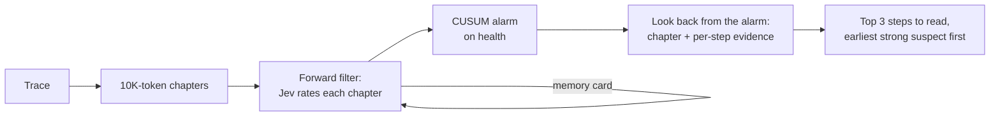

# Alibi

**We check whether your agent has an alibi for what it did.**

Alibi finds where a long AI-agent run went wrong. It borrows the playbook of automotive
driver-assistance systems: treat the run as a time series, filter it forward, detect the
fault, then smooth backward to the moment it began. The only sensor is Jev, TypeSafe AI's
System One model, which answers with calibrated probabilities instead of text.

It is built for long traces, where reading everything at once breaks down: on real coding
failures of 59K to 120K tokens, a single whole-trace read found the root-cause step in 0%
of cases; Alibi found it in 16% and 7.8%, and points to the right neighbourhood (within
3 steps) in 21% and 17%.

## How it works

| Stage | What happens | Driver-assistance analogue |
|---|---|---|
| Chapters | 10K-token windows with overlap, read one at a time | Measurement frames |
| Forward filter | Jev rates health and 4 warning signs per chapter; a memory card of numbers carries state forward | Recursive filter (predict + update) |
| CUSUM | Accumulates health drift; the first alarm marks the failure chapter | Fault detection |
| Look-back | Re-reads the alarm chapter and every earlier one in parallel, with hindsight | Fixed-interval (RTS-style) smoothing |
| Pick | P(chapter) x evidence per step; the earliest step within 80% of the top score | Fault-onset estimation |

## Results

Locked test sets, each run once against a pass bar written down beforehand:

| Test set | Traces | Median length | Alibi exact step | Alibi within 3 steps | Whole-trace read, exact |
|---|---|---|---|---|---|
| TrajErrBench SWE-Bench Pro (real coding failures) | 56 | 59K tokens | 16% | 21% | 0% (p = 0.004) |
| LongRCA SWE-bench Pro (real coding failures) | 90 | 120K tokens | 7.8% | 16.7% | 0% (p = 0.016) |
| LongRCA WebArena (real web-task failures) | 48 | 38K tokens | 12.5% | 20.8% | 16.9% published (no clear difference) |

Against published methods on the LongRCA leaderboard (all on DeepSeek-V4-Flash; exact
root step, same 128 SWE-bench Pro failures):

| Method | Exact root step |
|---|---|
| RCTA | 38.3% |
| **Alibi (Jev)** | **10.2%** |
| ECHO | 7.8% |
| FALAT | 2.3% |
| All-at-once (whole trace) | 1.6% |
| Step-by-step | 0.8% |
| Binary search | 0.8% |

Alibi ties ECHO (Fisher p = 0.66) and trails RCTA (p < 0.000001), which traces each
suspect back to the handoff instruction between agents.

## When to use it, and when not to

- Use it for traces of tens of thousands of tokens or more (default gate: 50K tokens).
- Do not use it for short traces: a single direct read by any capable model is enough,
  and Alibi says so without spending a call.
- Treat the output as "read these 3 steps first", not as a verdict.

## Speed and cost

- Each chapter is one Jev call, and chapters are judged in parallel on the way back. A
  38K-token trace is 4.6 chapters and 15 seconds of judge time; a 120K-token trace is
  17 chapters and about 48 seconds. No reasoning tokens are generated.
- Cost scales with trace length: about $0.10 per million trace tokens at Jev's price of
  $0.042 per million input tokens (roughly $0.01 for a 100K-token trace).

## Install

Claude Code:

    /plugin marketplace add ahmedezz26/alibi
    /plugin install alibi@alibi

Set `TYPESAFE_API_KEY` in your environment. Then ask Claude Code: "Why did my last
session go wrong?"

Command line:

    uv tool install git+https://github.com/ahmedezz26/alibi
    ALIBI_JUDGE_BACKEND=typesafe ALIBI_ALLOW_PAID_MODELS=1 TYPESAFE_API_KEY=... \
      alibi diagnose path/to/trace.json

## Privacy

Traces above the length gate are sent to TypeSafe's API. Claude Code session parsing is
best effort: the transcript format is internal to Claude Code and may change.

## Background

Alibi started as an experiment by an ADAS engineer: can the tracking filters used in cars
work on AI-agent traces? The research log with every pre-registered test, including the
ones that failed, is in [docs/research-log.md](docs/research-log.md).

## License

MIT
