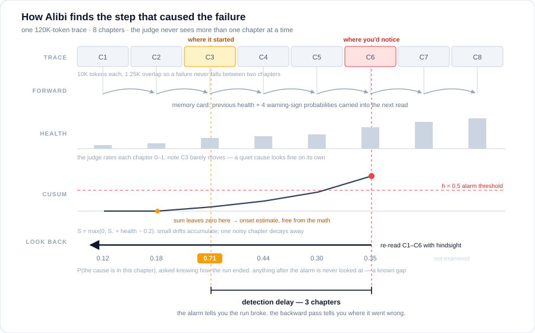

<p align="center">
  
</p>

# Alibi

[](https://github.com/ahmedezz26/alibi/actions/workflows/ci.yml)
[](https://pypi.org/project/agent-alibi/)
[](LICENSE)
[](pyproject.toml)

**We check whether your agent has an alibi for what it did.**

Alibi finds where a long AI-agent run went wrong. It borrows the playbook of automotive
driver-assistance systems: treat the run as a time series, filter it forward, detect the
fault, then smooth backward to the moment it began. The only sensor is Jev, TypeSafe AI's
System One model, which answers with calibrated probabilities instead of text.

It is built for long traces, where reading everything at once breaks down: on real coding
failures of 57K to 120K tokens, a single whole-trace read found the root-cause step in 0%
of cases; Alibi found it in 16% and 7.8%, and points to the right neighbourhood (within
3 steps) in 21% and 17%.

## How it works

<p align="center">
  
</p>

| Stage | What happens | Driver-assistance analogue |
|---|---|---|
| Chapters | Overlapping token windows, read one at a time. The size is `ALIBI_JUDGE_WINDOW_TOKENS`, default 10,000 - what every measurement below used | Measurement frames |
| Forward filter | Jev rates health and 4 warning signs per chapter; a memory card of numbers carries state forward | Recursive filter (predict + update) |
| CUSUM | Accumulates health drift; the first alarm marks the failure chapter | Fault detection |
| Look-back | Re-reads the alarm chapter and every earlier one in parallel, with hindsight | Fixed-interval (RTS-style) smoothing |
| Pick | P(chapter) x evidence per step; the earliest step within 80% of the top score | Fault-onset estimation |

## What you get

A short trace is refused, without spending a call:

    $ alibi diagnose examples/sample_trace.json
    Trace is 219 tokens, under the 50,000-token threshold: a single direct read is
    enough; Alibi adds value on long traces.

A long one comes back as three steps to read, in order. This is a real run from the
locked TrajErrBench set (a Claude Opus coding agent failing on a qutebrowser issue),
replayed from its recorded result:

    $ alibi diagnose trace.json
    Read these 3 steps first, in order.
    80,778 tokens, 10 chapters, alarm at chapter 6; 17 Jev calls, 35 s, $0.0096
    1. step 74 (assistant), chapter 6, score 0.277
       'Now I see the full picture. The test on line 458 expects
        `str(proc.outcome) == 'Testprocess crashed.'` for SIGSEGV...'
    2. step 76 (assistant), chapter 6, score 0.202
       '## Phase 5: FIX ANALYSIS\n\nNow I have a clear understanding. Let me
        implement the changes to `guiprocess.py`...'
    3. step 78 (assistant), chapter 6, score 0.178
       'Now let me implement all the changes:\nTool calls:\nstr_replace_editor(...'

Step 74 is the labelled root cause: the agent reads the test wrong and every later
edit builds on that reading. Being right at rank 1 happens on 16% of these traces;
the honest claim is that three steps out of 118 is a much smaller haystack.

## Results

Locked test sets, each run once against a pass bar written down beforehand:

| Test set | Traces | Median length | Alibi exact step | Alibi within 3 steps | Whole-trace read, exact |
|---|---|---|---|---|---|
| TrajErrBench SWE-Bench Pro (real coding failures) | 56 | 57K tokens | 16% | 21% | 0% (p = 0.004) |
| LongRCA SWE-bench Pro (real coding failures) | 90 | 120K tokens | 7.8% | 16.7% | 0% (p = 0.016) |
| LongRCA WebArena (real web-task failures) | 48 | 38K tokens | 12.5% | 20.8% | 16.9% published (no clear difference) |

Against published methods on the LongRCA leaderboard (all on DeepSeek-V4-Flash; exact
root step, same 128 SWE-bench Pro failures):

| Method | Exact root step |
|---|---|
| RCTA | 38.3% |
| **Alibi (Jev)** | **10.2%** |
| ECHO | 7.8% |
| FALAT | 2.3% |
| All-at-once (whole trace) | 1.6% |
| Step-by-step | 0.8% |
| Binary search | 0.8% |

Alibi ties ECHO (Fisher p = 0.66) and trails RCTA (p < 0.000001), which traces each
suspect back to the handoff instruction between agents.

## When to use it, and when not to

- Use it for traces of tens of thousands of tokens or more (default gate: 50K tokens).
- Do not use it for short traces: a single direct read by any capable model is enough,
  and Alibi says so without spending a call.
- Treat the output as "read these 3 steps first", not as a verdict.

## Speed and cost

- Each chapter is one Jev call, and chapters are judged in parallel on the way back. A
  38K-token trace is 4.6 chapters and 15 seconds of judge time; a 120K-token trace is
  17 chapters and about 48 seconds. No reasoning tokens are generated.
- Cost scales with trace length: about $0.08 per million trace tokens at Jev's price of
  $0.042 per million input tokens, since every token is read about twice (forward, then the
  look-back). That is roughly $0.01 for a 100K-token trace, and $0.02 for a 250K one.

## Install and run

**Claude Code.**

    /plugin marketplace add ahmedezz26/alibi
    /plugin install alibi@alibi

Set `TYPESAFE_API_KEY` in the shell you start Claude Code from. The plugin does the rest: it
starts the MCP server with `uvx` and sets the other two variables itself. Then ask it *"why
did my last session go wrong?"*

**Command line.** The PyPI distribution is `agent-alibi`; the import package is `alibi`.

    uv tool install agent-alibi
    export ALIBI_JUDGE_BACKEND=typesafe ALIBI_ALLOW_PAID_MODELS=1 TYPESAFE_API_KEY=...
    alibi diagnose path/to/trace.json

All three variables are required - Jev is a paid API and `ALIBI_ALLOW_PAID_MODELS` is the
spend guard. Miss one and the run stops at exit 2 naming what is missing, having sent
nothing. A `.env` beside the directory you run from is read for any of them you did not set.

Short traces need no key at all, so you can check the install before you have one:

    $ printf '[{"type":"user","inputs":{"q":"hi"}}]' > /tmp/t.json
    $ alibi diagnose /tmp/t.json
    Trace is 9 tokens, under the 50,000-token threshold: a single direct read is enough;
    Alibi adds value on long traces.

## What you can point it at

One trace per run. `--source auto`, the default, picks by file extension.

**A JSON file** (`.json`) - a list of steps, oldest first. Every field is optional, but include
`outputs` and `error` where you have them: a misread observation or an unfixed error is most of
the signal the method looks for.

```json
[
  {"type": "llm",  "name": "plan",           "inputs": {"task": "Book the cheapest direct flight."},
                                             "outputs": {"text": "Plan: search, filter, pick."}},
  {"type": "tool", "name": "search_flights", "inputs": {"from": "CAI", "to": "BER"},
                                             "outputs": {"flights": []}},
  {"type": "tool", "name": "book",           "inputs": {"flight": "TK33"}, "error": "not direct"}
]
```

Other keys read: `name`, `step_id`, `timestamp` (ISO 8601; an unparseable one is rejected with
exit 2). Steps are numbered by position, so `step 74` is the 75th entry in the file.
`examples/sample_trace.json` is a working example. For any other format, convert it to this
shape or add a `TraceSource` adapter (see [CONTRIBUTING.md](CONTRIBUTING.md)).

**A Claude Code session** (`.jsonl`) - the transcripts under `~/.claude/projects/`, in a folder
named after your project path with `/`, `_` and `.` turned into `-`:

    alibi diagnose ~/.claude/projects/-Users-me-LLM-projects-app/<session-id>.jsonl

For the most recent session of the project you are standing in, without looking the name up:

    alibi diagnose "$(ls -t ~/.claude/projects/"${PWD//[\/_.]/-}"/*.jsonl | head -1)"

A real working session is often past the 250K ceiling, and is then refused with its cost
rather than analysed. If the estimate is fine, say so: `--max-trace-tokens 400000`. Parsing is
best effort, since the format is internal to Claude Code: assistant text, tool calls and tool
results become steps, and thinking blocks are skipped.

**A LangSmith trace** - the trace id and the project, with `LANGSMITH_API_KEY` set:

    alibi diagnose <trace-id> --source langsmith --project "my-project"

There is no folder mode: the method is a filter over one time series. To sweep a directory,
loop:

    for f in traces/*.json; do alibi diagnose "$f" --json > "${f%.json}.diagnosis.json"; done

## Reading the result

In the output above:

- **alarm at chapter N** - where CUSUM first saw the agent's health break down. The cause is
  usually at or before it, which is why the look-back starts there. `None` means no alarm fired
  and the run's ending was used as the anchor instead.
- **score** - fused evidence for that step, not a probability. Only the ordering is meaningful.
- **steps** are 0-based positions in the trace you passed in.

`--json` prints the same result as an object, for piping into something else.

Exit codes: **0** on success, a gated trace included. **2** for anything refused before a judge
was built, which always means nothing was sent and nothing was spent. **3** if the run failed
once the judge had started reading, where the message says how many calls were billed.

## The two gates, and what they cost

Nothing is sent anywhere, and nothing is spent, unless the trace falls between them:

| Trace size | What happens | Override |
|---|---|---|
| Under 50,000 tokens | Not analysed: "a single direct read is enough" | `--min-trace-tokens`, `ALIBI_MIN_TRACE_TOKENS` |
| 50,000 to 250,000 tokens | Analysed; about $0.01 per 100K tokens | |
| Over 250,000 tokens | Refused with an estimated cost, so a huge transcript cannot spend unannounced | `--max-trace-tokens`, `ALIBI_MAX_TRACE_TOKENS` |

## The MCP tool

The server (`alibi-mcp`, stdio) exposes exactly one tool for any MCP client, not just
Claude Code:

    diagnose_trace(trace: str, source: str = "auto", project: str | None = None) -> Diagnosis

`trace` is the same path or id the CLI takes. To wire it up by hand:

```json
{ "mcpServers": { "alibi": {
  "command": "uvx",
  "args": ["--from", "agent-alibi>=0.1,<0.2", "alibi-mcp"],
  "env": { "TYPESAFE_API_KEY": "...", "ALIBI_JUDGE_BACKEND": "typesafe",
           "ALIBI_ALLOW_PAID_MODELS": "1" } } } }
```

## Privacy

Traces above the length gate are sent to TypeSafe's API; below it, nothing leaves your
machine. There is no telemetry. Claude Code session parsing is best effort: the transcript
format is internal to Claude Code and may change. Session transcripts often contain source
code and secrets, so read [SECURITY.md](SECURITY.md) before diagnosing one.

## Contributing

See [CONTRIBUTING.md](CONTRIBUTING.md). Plumbing, adapters, bug fixes and docs are welcome as
ordinary pull requests; changes to the estimation method need a pre-registered measurement,
for the reason the research log makes obvious.

## Background

Alibi started as an experiment by an ADAS engineer: can the tracking filters used in cars
work on AI-agent traces? The research log with every pre-registered test, including the
ones that failed, is in [docs/research-log.md](docs/research-log.md).

## License

MIT
