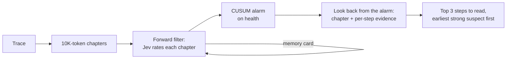

# Alibi MCP Server + Claude Code Plugin Implementation Plan

> **For agentic workers:** REQUIRED SUB-SKILL: Use superpowers:subagent-driven-development (recommended) or superpowers:executing-plans to implement this plan task-by-task. Steps use checkbox (`- [ ]`) syntax for tracking.

**Goal:** Package the V2 method (forward filter + CUSUM + look-back, Jev as the only sensor) as an open-source MCP server and Claude Code plugin that tells a developer which 3 steps of a long agent trace to read first.

**Architecture:** One shared entry point, `alibi.localize.diagnose()`, runs exactly the V2 pipeline behind a length gate. The CLI (`alibi diagnose`), the MCP server (`alibi-mcp`, one tool) and the Claude Code plugin (MCP server + one skill) all call it. The plugin lives in `plugin/` and is published through a marketplace file at the repo root; it starts the server with `uvx` straight from the GitHub repo.

**Tech Stack:** Python 3.12, uv, `mcp` 2.2.x (`MCPServer`, in-memory `Client` for tests), pydantic (via mcp), `langchain-typesafe` (Jev, existing), pytest, ruff.

**Spec:** the decisions below, agreed with the user on 2026-09-19/20 (no separate spec file):
- V2 only: `--card gap --checks --combine-rule step_plus_check --pick earliest_near_best`, 10K-token windows, overlap = window // 8, CUSUM k = 0.2, h = 0.5. Jev backend only (typed pipeline).
- The method is only for long traces: default length gate 50,000 tokens (evidence: wins at 59K and 120K coding traces; no edge at 38K web traces). Below the gate: no Jev call, a message saying one direct read is enough.
- Output = top-3 suspect steps (never one "verdict"), with chapter, score, step type/name and a short preview, plus the alarm chapter, cost and judge time.
- Inputs: JSON trace files (core), LangSmith (existing adapter), Claude Code session transcripts (best effort: the format is internal to Claude Code and may change).
- MIT licence, public GitHub repo `ahmedezz26/alibi`; commit author rewritten to the GitHub noreply address before the first push; README without emojis, one-line pitch "We check whether your agent has an alibi for what it did."; speed stated as measured per-chapter time; cost stated as a rate.

## Global Constraints

- Judge access only through `alibi.judges.make_judge`; no other module imports a concrete judge (CLAUDE.md coding conventions).
- Model IDs, window sizes, thresholds come only from `alibi/config.py` (CLAUDE.md).
- Never make a paid call in tests: tests use fake judges; `make_judge` keeps refusing paid models unless `ALIBI_ALLOW_PAID_MODELS=1`.
- `uv run pytest` and `uv run ruff check . && uv run ruff format --check .` must pass after every task.
- No emojis in README or plugin text.
- Commit messages end with:
  `Co-Authored-By: Claude Opus 5 <noreply@anthropic.com>` and
  `Claude-Session: https://claude.ai/code/session_01ESAamLG6RT9G1wpm5tWFuP`
- Do not push, create the GitHub repo or rewrite history without the user's explicit go at that step (Task 7).

---

## File Structure

| File | Responsibility |
|---|---|
| `src/alibi/config.py` (modify) | add `min_trace_tokens` setting (`ALIBI_MIN_TRACE_TOKENS`, default 50,000) |
| `src/alibi/localize.py` (create) | `Suspect`, `Diagnosis` pydantic models; `V2_CONFIG`; `diagnose(steps, judge, settings)` |
| `src/alibi/sources/claudecode.py` (create) | best-effort `ClaudeCodeTraceSource` for `~/.claude/projects/*/*.jsonl` |
| `src/alibi/sources/auto.py` (create) | `load_steps(path_or_id, source="auto")`: pick the adapter |
| `src/alibi/cli.py` (modify) | `alibi diagnose` subcommand |
| `src/alibi/mcp_server.py` (create) | `build_server(judge_factory)` with tool `diagnose_trace`; `main()` runs stdio |
| `pyproject.toml` (modify) | `mcp` dependency; `alibi-mcp` script; project metadata, MIT |
| `plugin/.claude-plugin/plugin.json`, `plugin/.mcp.json`, `plugin/skills/diagnose-trace/SKILL.md` (create) | the Claude Code plugin |
| `.claude-plugin/marketplace.json` (create) | makes the repo installable with `/plugin marketplace add ahmedezz26/alibi` |
| `README.md`, `LICENSE`, `docs/research-log.md` (create); `CLAUDE.md`, `docs/PROGRESS.md` (modify/move) | open-source release prep |
| `tests/test_localize.py`, `tests/test_claudecode.py`, `tests/test_auto_source.py`, `tests/test_cli_diagnose.py`, `tests/test_mcp_server.py`, `tests/test_plugin_files.py` (create) | tests |

---

### Task 1: Shared V2 entry point with a length gate

**Files:**
- Modify: `src/alibi/config.py`
- Create: `src/alibi/localize.py`
- Test: `tests/test_localize.py`

**Interfaces:**
- Consumes: `chunk_trace(steps, max_tokens, overlap_tokens)`, `trace_tokens(steps)` (chunking.py); `forward_pass_typed(judge, chunks, steps, propagate_state=True) -> list[ChunkScore]` (forward.py); `detect_drift(scores, k, h) -> list[ChangePoint]` (`.alarm`); `backward_pass_typed(judge, chunks, steps, forward, alarms, known_failed=True, rule=..., card=..., checks=..., pick=...) -> Localization` (`.failure_chunk`, `.anchor`, `.ranked: tuple[(step, score)]`, TOP_K = 3) (backward.py); `Settings` / `load_settings()` (config.py).
- Produces: `Suspect(step: int, score: float, chapter: int, step_type: str, name: str | None, preview: str)`; `Diagnosis(gated: bool, message: str, trace_tokens: int, n_steps: int, n_chapters: int, alarm_chapter: int | None, anchor: str | None, suspects: list[Suspect], judge_calls: int, judge_seconds: float, cost_usd: float)`; `diagnose(steps: list[Step], judge: Judge | None, settings: Settings) -> Diagnosis` (judge may be None when gated).

- [ ] **Step 1: Write the failing tests**

```python
# tests/test_localize.py
import pytest

from alibi.config import load_settings
from alibi.localize import Diagnosis, diagnose
from alibi.types import Step


class TypedJudge:
    """Health jumps at the last chapter; step 7 is the likeliest cause."""

    def __init__(self):
        self.calls = []

    def evaluate(self, state, questions):
        out = {}
        for q in questions:
            if q.answer_type == "score":
                out[q.id] = 1.0 if "[step 8]" in state else 0.0
            elif q.answer_type == "choice":
                first = next(iter(q.criteria))
                out[q.id] = {"choice": first, "probabilities": {first: 1.0}, "confidence": 1.0}
            elif q.id == "s7":
                out[q.id] = 0.9
            else:
                out[q.id] = 0.1
        return out


def steps(n=9, chars=400):
    kinds = ["user"] + ["assistant", "tool"] * n
    return [Step(str(i), kinds[i], None, {"content": "x" * chars}) for i in range(n)]


def settings(**over):
    s = load_settings()
    return s.__class__(**{**s.__dict__, "judge_window_tokens": 300, **over})


def test_short_trace_is_gated_without_calling_the_judge():
    d = diagnose(steps(), judge=None, settings=settings(min_trace_tokens=10_000))
    assert isinstance(d, Diagnosis)
    assert d.gated and d.suspects == [] and d.judge_calls == 0
    assert "direct read" in d.message


def test_long_trace_returns_top_suspects_with_context():
    d = diagnose(steps(), judge=TypedJudge(), settings=settings(min_trace_tokens=0))
    assert not d.gated
    assert d.n_chapters > 1 and d.alarm_chapter is not None
    assert 1 <= len(d.suspects) <= 3
    assert d.suspects[0].step == 7
    assert d.suspects[0].step_type == "assistant"
    assert d.suspects[0].preview.startswith("xxx")
    assert all(s.chapter >= 0 for s in d.suspects)


def test_long_trace_without_a_judge_is_an_error():
    with pytest.raises(ValueError, match="judge"):
        diagnose(steps(), judge=None, settings=settings(min_trace_tokens=0))
```

- [ ] **Step 2: Run the tests to verify they fail**

Run: `uv run pytest tests/test_localize.py -v`
Expected: FAIL, `ModuleNotFoundError: No module named 'alibi.localize'`.

- [ ] **Step 3: Add the setting**

In `src/alibi/config.py`, add the constant next to the other defaults, the field to `Settings` (after `judge_window_tokens`), and read it in `load_settings()`:

```python
# The method only beats a single whole-trace read on long traces (wins measured at 59K and
# 120K tokens; no edge at 38K). Shorter traces are gated: one direct read is enough.
DEFAULT_MIN_TRACE_TOKENS = 50_000
```

```python
    min_trace_tokens: int = DEFAULT_MIN_TRACE_TOKENS
```

```python
        min_trace_tokens=int(
            os.environ.get("ALIBI_MIN_TRACE_TOKENS") or DEFAULT_MIN_TRACE_TOKENS
        ),
```

- [ ] **Step 4: Write `src/alibi/localize.py`**

```python
"""The product entry point: run V2 (forward filter, CUSUM, look-back; Jev as the sensor) on
one trace and return the top suspect steps. Shared by the CLI, the MCP server and the plugin.

Only long traces are analysed: below ``settings.min_trace_tokens`` a single direct read is
enough, so no judge call is made.
"""

from __future__ import annotations

from pydantic import BaseModel, Field

from alibi.backward import backward_pass_typed
from alibi.chunking import chunk_trace, render_step, trace_tokens
from alibi.config import Settings
from alibi.drift import detect_drift
from alibi.forward import forward_pass_typed
from alibi.judges import Judge
from alibi.types import Step

# V2, the adopted method (see docs/research-log.md).
V2_CONFIG = {
    "card": "gap",
    "checks": True,
    "rule": "step_plus_check",
    "pick": "earliest_near_best",
    "cusum_k": 0.2,
    "cusum_h": 0.5,
}
PREVIEW_CHARS = 300


class Suspect(BaseModel):
    step: int = Field(description="0-based step index in the trace.")
    score: float = Field(description="Fused evidence score (higher = more likely the cause).")
    chapter: int = Field(description="Index of the 10K-token chapter holding the step.")
    step_type: str
    name: str | None = None
    preview: str = Field(description="Start of the step's rendered text.")


class Diagnosis(BaseModel):
    gated: bool = Field(description="True when the trace was too short to analyse.")
    message: str
    trace_tokens: int
    n_steps: int
    n_chapters: int = 0
    alarm_chapter: int | None = None
    anchor: str | None = None
    suspects: list[Suspect] = []
    judge_calls: int = 0
    judge_seconds: float = 0.0
    cost_usd: float = 0.0


def diagnose(steps: list[Step], judge: Judge | None, settings: Settings) -> Diagnosis:
    tokens = trace_tokens(steps)
    if tokens < settings.min_trace_tokens:
        return Diagnosis(
            gated=True,
            message=(
                f"Trace is {tokens:,} tokens, under the {settings.min_trace_tokens:,}-token "
                "threshold: a single direct read is enough; Alibi adds value on long traces."
            ),
            trace_tokens=tokens,
            n_steps=len(steps),
        )
    if judge is None:
        raise ValueError("a typed (Jev) judge is required for traces above the length gate")
    window = settings.judge_window_tokens
    chunks = chunk_trace(steps, window, window // 8)
    fwd = forward_pass_typed(judge, chunks, steps)
    alarms = [
        cp.alarm
        for cp in detect_drift([s.score for s in fwd], V2_CONFIG["cusum_k"], V2_CONFIG["cusum_h"])
    ]
    loc = backward_pass_typed(
        judge,
        chunks,
        steps,
        fwd,
        alarms,
        known_failed=True,
        rule=V2_CONFIG["rule"],
        card=V2_CONFIG["card"],
        checks=V2_CONFIG["checks"],
        pick=V2_CONFIG["pick"],
    )
    ranked = list(loc.ranked)
    # The pick (earliest near the top) leads, then the rest of the ranking.
    order = [loc.critical_step] + [i for i, _ in ranked if i != loc.critical_step]
    scores = dict(ranked)
    suspects = [_suspect(i, scores.get(i, 0.0), chunks, steps) for i in order[:3]]
    calls = getattr(judge, "calls", [])
    return Diagnosis(
        gated=False,
        message=f"Read these {len(suspects)} steps first, in order.",
        trace_tokens=tokens,
        n_steps=len(steps),
        n_chapters=len(chunks),
        alarm_chapter=alarms[0] if alarms else None,
        anchor=loc.anchor,
        suspects=suspects,
        judge_calls=len(calls),
        judge_seconds=round(sum(c.latency_s for c in calls), 1),
        cost_usd=round(sum(c.cost or 0 for c in calls), 5),
    )


def _suspect(i: int, score: float, chunks, steps: list[Step]) -> Suspect:
    chapter = min(c.index for c in chunks if c.start <= i < c.end)
    return Suspect(
        step=i,
        score=round(score, 4),
        chapter=chapter,
        step_type=steps[i].type,
        name=steps[i].name,
        preview=_preview(i, steps[i]),
    )


def _preview(i: int, step: Step) -> str:
    """The step's own text when it has a `content` field, else its rendered form."""
    text = step.inputs.get("content")
    return str(text if text is not None else render_step(i, step))[:PREVIEW_CHARS]
```

- [ ] **Step 5: Run the tests**

Run: `uv run pytest tests/test_localize.py -v`
Expected: 3 passed. Then `uv run pytest -q` (all green) and `uv run ruff check . && uv run ruff format .`.

- [ ] **Step 6: Commit**

```bash
git add src/alibi/config.py src/alibi/localize.py tests/test_localize.py
git commit -m "feat: diagnose() product entry point running V2 behind a length gate"
```

---

### Task 2: Trace inputs (JSON, LangSmith, Claude Code sessions)

**Files:**
- Create: `src/alibi/sources/claudecode.py`, `src/alibi/sources/auto.py`
- Test: `tests/test_claudecode.py`, `tests/test_auto_source.py`

**Interfaces:**
- Consumes: `JsonFileTraceSource(directory).get_trace(path_or_id)`, `LangSmithTraceSource` (existing `sources/langsmith.py`), `Step`.
- Produces: `ClaudeCodeTraceSource().get_trace(path: str) -> list[Step]`; `load_steps(path_or_id: str, source: str = "auto", project: str | None = None) -> list[Step]` with `source in {"auto", "json", "claude-code", "langsmith"}`; `auto` = `claude-code` for `.jsonl`, `json` for `.json`, else `langsmith`.

- [ ] **Step 1: Write the failing tests**

```python
# tests/test_claudecode.py
import json

from alibi.sources.claudecode import ClaudeCodeTraceSource


def write(tmp_path, entries):
    p = tmp_path / "session.jsonl"
    p.write_text("\n".join(json.dumps(e) for e in entries))
    return p


def test_messages_tool_calls_and_results_become_steps(tmp_path):
    p = write(
        tmp_path,
        [
            {"type": "mode", "mode": "default"},
            {"type": "user", "message": {"role": "user", "content": "fix the test"}},
            {
                "type": "assistant",
                "message": {
                    "role": "assistant",
                    "content": [
                        {"type": "thinking", "thinking": "hmm"},
                        {"type": "text", "text": "Running the tests."},
                        {"type": "tool_use", "name": "Bash", "input": {"command": "pytest"}},
                    ],
                },
            },
            {
                "type": "user",
                "message": {
                    "role": "user",
                    "content": [{"type": "tool_result", "content": "1 failed"}],
                },
            },
        ],
    )
    steps = ClaudeCodeTraceSource().get_trace(str(p))
    assert [(s.type, s.name) for s in steps] == [
        ("user", None),
        ("assistant", None),
        ("assistant", "Bash"),
        ("tool", None),
    ]
    assert steps[2].inputs == {"command": "pytest"}
    assert steps[3].inputs == {"content": "1 failed"}


def test_unknown_lines_are_skipped(tmp_path):
    p = write(tmp_path, [{"type": "attachment"}, {"type": "user", "message": {"content": "hi"}}])
    assert len(ClaudeCodeTraceSource().get_trace(str(p))) == 1
```

```python
# tests/test_auto_source.py
import json

from alibi.sources.auto import load_steps


def test_json_file_is_read_with_the_json_adapter(tmp_path):
    p = tmp_path / "t.json"
    p.write_text(json.dumps([{"type": "user", "inputs": {"q": "hi"}}]))
    assert load_steps(str(p))[0].inputs == {"q": "hi"}


def test_jsonl_file_is_read_as_a_claude_code_session(tmp_path):
    p = tmp_path / "s.jsonl"
    p.write_text(json.dumps({"type": "user", "message": {"content": "hi"}}))
    assert load_steps(str(p))[0].type == "user"
```

- [ ] **Step 2: Run to verify they fail**

Run: `uv run pytest tests/test_claudecode.py tests/test_auto_source.py -v`
Expected: FAIL, modules not found.

- [ ] **Step 3: Write `src/alibi/sources/claudecode.py`**

```python
"""Best-effort TraceSource for Claude Code session transcripts
(``~/.claude/projects/<project>/<session-id>.jsonl``).

The JSONL format is internal to Claude Code and may change between versions
(https://code.claude.com/docs/en/sessions.md). Unknown lines and block types are skipped.
Thinking blocks are skipped: they are often redacted and are not the agent's actions.
"""

from __future__ import annotations

import json
from pathlib import Path
from typing import Any

from alibi.types import Step


class ClaudeCodeTraceSource:
    def get_trace(self, trace_id: str) -> list[Step]:
        steps: list[Step] = []
        for line in Path(trace_id).read_text().splitlines():
            if not line.strip():
                continue
            entry = json.loads(line)
            if entry.get("type") not in ("user", "assistant"):
                continue
            for kind, name, inputs in _blocks(entry):
                steps.append(Step(str(len(steps)), kind, None, inputs, name=name))
        return steps


def _blocks(entry: dict[str, Any]):
    content = (entry.get("message") or {}).get("content")
    role = entry["type"]
    if isinstance(content, str):
        yield role, None, {"content": content}
        return
    for block in content or []:
        t = block.get("type")
        if t == "text":
            yield role, None, {"content": block.get("text", "")}
        elif t == "tool_use":
            yield "assistant", block.get("name"), block.get("input") or {}
        elif t == "tool_result":
            yield "tool", None, {"content": _text(block.get("content"))}


def _text(content: Any) -> str:
    if isinstance(content, list):
        return "\n".join(str(c.get("text", c)) if isinstance(c, dict) else str(c) for c in content)
    return "" if content is None else str(content)
```

- [ ] **Step 4: Write `src/alibi/sources/auto.py`**

```python
"""Pick a TraceSource for one trace given as a file path or a LangSmith trace id."""

from __future__ import annotations

from alibi.types import Step

SOURCES = ("auto", "json", "claude-code", "langsmith")


def load_steps(path_or_id: str, source: str = "auto", project: str | None = None) -> list[Step]:
    if source not in SOURCES:
        raise ValueError(f"source must be one of {SOURCES}, got {source!r}")
    if source == "auto":
        if path_or_id.endswith(".jsonl"):
            source = "claude-code"
        elif path_or_id.endswith(".json"):
            source = "json"
        else:
            source = "langsmith"
    if source == "claude-code":
        from alibi.sources.claudecode import ClaudeCodeTraceSource

        return ClaudeCodeTraceSource().get_trace(path_or_id)
    if source == "json":
        from alibi.sources.jsonfile import JsonFileTraceSource

        return JsonFileTraceSource().get_trace(path_or_id)
    from alibi.sources.langsmith import LangSmithTraceSource

    return LangSmithTraceSource(project=project).get_trace(path_or_id)
```

Before writing the LangSmith branch, open `src/alibi/sources/langsmith.py` and use its real constructor signature (it is used by `alibi score --source langsmith --project`); match that call exactly.

- [ ] **Step 5: Run the tests**

Run: `uv run pytest tests/test_claudecode.py tests/test_auto_source.py -v` → all pass; `uv run pytest -q`; ruff.

- [ ] **Step 6: Commit**

```bash
git add src/alibi/sources/claudecode.py src/alibi/sources/auto.py tests/test_claudecode.py tests/test_auto_source.py
git commit -m "feat: Claude Code session adapter and automatic trace source selection"
```

---

### Task 3: `alibi diagnose` CLI

**Files:**
- Modify: `src/alibi/cli.py`
- Test: `tests/test_cli_diagnose.py`

**Interfaces:**
- Consumes: `diagnose(steps, judge, settings) -> Diagnosis`, `load_steps(path_or_id, source, project)`, `make_judge(settings)`, `load_settings()`.
- Produces: `alibi diagnose PATH_OR_ID [--source auto|json|claude-code|langsmith] [--project P] [--min-tokens N] [--json]`; exit code 0; prints a table of suspects, or JSON (`Diagnosis.model_dump_json(indent=2)`) with `--json`. A long trace with a non-Jev backend exits with code 2 and the message `Alibi needs the Jev backend: set ALIBI_JUDGE_BACKEND=typesafe and TYPESAFE_API_KEY`.

- [ ] **Step 1: Write the failing tests**

```python
# tests/test_cli_diagnose.py
import json

from alibi import cli


def trace_file(tmp_path, n=3):
    p = tmp_path / "t.json"
    p.write_text(json.dumps([{"type": "user", "inputs": {"q": "hi"}}] * n))
    return str(p)


def test_short_trace_prints_the_gate_message_without_a_judge(tmp_path, capsys, monkeypatch):
    def no_judge(*_args, **_kwargs):
        raise AssertionError("a gated trace must not build a judge")

    monkeypatch.setattr(cli, "make_judge", no_judge)
    assert cli.main(["diagnose", trace_file(tmp_path)]) == 0
    assert "direct read" in capsys.readouterr().out


def test_json_output_is_a_diagnosis(tmp_path, capsys):
    assert cli.main(["diagnose", trace_file(tmp_path), "--json"]) == 0
    out = json.loads(capsys.readouterr().out)
    assert out["gated"] is True and out["suspects"] == []


def test_long_trace_needs_the_jev_backend(tmp_path, capsys, monkeypatch):
    monkeypatch.setenv("ALIBI_JUDGE_BACKEND", "openrouter")
    assert cli.main(["diagnose", trace_file(tmp_path), "--min-tokens", "0"]) == 2
    assert "ALIBI_JUDGE_BACKEND=typesafe" in capsys.readouterr().err
```

Before writing these, open `src/alibi/cli.py` and check how `main` is defined (its name, whether it takes `argv`, and whether it returns an exit code). If `main` does not accept `argv` or return a code, make the smallest change so that `main(argv: list[str] | None = None) -> int` works for both the console script and tests, keeping existing subcommands unchanged.

- [ ] **Step 2: Run to verify they fail**

Run: `uv run pytest tests/test_cli_diagnose.py -v`
Expected: FAIL, `invalid choice: 'diagnose'`.

- [ ] **Step 3: Add the subcommand**

Register the parser next to `score`:

```python
    diag = sub.add_parser(
        "diagnose", help="V2 + Jev: the 3 steps of a long agent trace to read first"
    )
    diag.add_argument("trace", help="path to a .json / Claude Code .jsonl trace, or a LangSmith id")
    diag.add_argument("--source", choices=["auto", "json", "claude-code", "langsmith"],
                      default="auto")
    diag.add_argument("--project", help="LangSmith project name")
    diag.add_argument("--min-tokens", type=int, help="override the length gate")
    diag.add_argument("--json", action="store_true", help="print the Diagnosis as JSON")
```

Handler (dispatch it where the other subcommands are dispatched):

```python
def _diagnose(args: argparse.Namespace) -> int:
    from dataclasses import replace

    from alibi.localize import diagnose
    from alibi.sources.auto import load_steps

    settings = load_settings()
    if args.min_tokens is not None:
        settings = replace(settings, min_trace_tokens=args.min_tokens)
    steps = load_steps(args.trace, args.source, args.project)
    judge = None
    if trace_tokens(steps) >= settings.min_trace_tokens:
        if settings.judge_backend != "typesafe":
            print(
                "Alibi needs the Jev backend: set ALIBI_JUDGE_BACKEND=typesafe and "
                "TYPESAFE_API_KEY",
                file=sys.stderr,
            )
            return 2
        judge = make_judge(settings)
    d = diagnose(steps, judge, settings)
    if args.json:
        print(d.model_dump_json(indent=2))
        return 0
    print(d.message)
    if not d.gated:
        print(f"{d.trace_tokens:,} tokens, {d.n_chapters} chapters, alarm at chapter "
              f"{d.alarm_chapter}; {d.judge_calls} Jev calls, {d.judge_seconds:.0f} s, "
              f"${d.cost_usd:.4f}")
        for rank, s in enumerate(d.suspects, 1):
            print(f"{rank}. step {s.step} ({s.step_type}{' ' + s.name if s.name else ''}), "
                  f"chapter {s.chapter}, score {s.score:.3f}\n   {s.preview[:160]!r}")
    return 0
```

`Settings` is a dataclass (check `config.py`); if it is frozen, `dataclasses.replace` works as written. Import `trace_tokens` from `alibi.chunking` and `sys` at the top of `cli.py` if they are not already imported.

- [ ] **Step 4: Run the tests**

Run: `uv run pytest tests/test_cli_diagnose.py -v` → 3 pass; `uv run pytest -q`; ruff.

- [ ] **Step 5: Commit**

```bash
git add src/alibi/cli.py tests/test_cli_diagnose.py
git commit -m "feat: alibi diagnose command"
```

---

### Task 4: MCP server with one tool

**Files:**
- Create: `src/alibi/mcp_server.py`
- Modify: `pyproject.toml` (dependency + script)
- Test: `tests/test_mcp_server.py`

**Interfaces:**
- Consumes: `diagnose`, `Diagnosis`, `load_steps`, `make_judge`, `load_settings`.
- Produces: `build_server(judge_factory=None) -> MCPServer` with tool `diagnose_trace(trace: str, source: str = "auto", project: str | None = None) -> Diagnosis`; `main()` runs stdio; console script `alibi-mcp = "alibi.mcp_server:main"`.

- [ ] **Step 1: Add the dependency**

Run: `uv add "mcp>=2.2,<3"` and `uv add --dev anyio`
Then in `pyproject.toml` under `[project.scripts]` add: `alibi-mcp = "alibi.mcp_server:main"`.

- [ ] **Step 2: Write the failing tests**

```python
# tests/test_mcp_server.py
import json

import pytest
from mcp import Client

from alibi.mcp_server import build_server


def trace_file(tmp_path, n=3):
    p = tmp_path / "t.json"
    p.write_text(json.dumps([{"type": "user", "inputs": {"q": "hi"}}] * n))
    return str(p)


@pytest.mark.anyio
async def test_lists_one_diagnose_tool():
    async with Client(build_server()) as client:
        tools = await client.list_tools()
    assert [t.name for t in tools.tools] == ["diagnose_trace"]


@pytest.mark.anyio
async def test_short_trace_is_gated_and_never_builds_a_judge(tmp_path):
    def factory():
        raise AssertionError("no judge for gated traces")

    async with Client(build_server(judge_factory=factory)) as client:
        result = await client.call_tool("diagnose_trace", {"trace": trace_file(tmp_path)})
    assert result.structured_content["gated"] is True
    assert result.structured_content["suspects"] == []
```

Add to `tests/conftest.py` (create if missing):

```python
import pytest


@pytest.fixture
def anyio_backend():
    return "asyncio"
```

- [ ] **Step 3: Run to verify they fail**

Run: `uv run pytest tests/test_mcp_server.py -v`
Expected: FAIL, `No module named 'alibi.mcp_server'`.

- [ ] **Step 4: Write `src/alibi/mcp_server.py`**

```python
"""Alibi as an MCP server: one tool that runs V2 (Jev) on a long agent trace.

Run: ``alibi-mcp`` (stdio). Needs ALIBI_JUDGE_BACKEND=typesafe, TYPESAFE_API_KEY and
ALIBI_ALLOW_PAID_MODELS=1 for traces above the length gate (Jev is a paid API).
"""

from __future__ import annotations

from collections.abc import Callable

from mcp.server import MCPServer

from alibi.chunking import trace_tokens
from alibi.config import load_settings
from alibi.judges import Judge, make_judge
from alibi.localize import Diagnosis, diagnose
from alibi.sources.auto import load_steps


def build_server(judge_factory: Callable[[], Judge] | None = None) -> MCPServer:
    server = MCPServer("alibi")

    @server.tool()
    def diagnose_trace(trace: str, source: str = "auto", project: str | None = None) -> Diagnosis:
        """Find where a long AI-agent run went wrong. Reads the trace chapter by chapter
        (never all at once), raises a CUSUM alarm, looks back, and returns the 3 steps to
        read first. `trace`: path to a .json trace or a Claude Code session .jsonl, or a
        LangSmith trace id. Traces under the length gate (default 50K tokens) are not
        analysed: a direct read is enough."""
        settings = load_settings()
        steps = load_steps(trace, source, project)
        judge = None
        if trace_tokens(steps) >= settings.min_trace_tokens:
            judge = (judge_factory or (lambda: make_judge(settings)))()
        return diagnose(steps, judge, settings)

    return server


def main() -> None:
    build_server().run("stdio")
```

- [ ] **Step 5: Run the tests**

Run: `uv run pytest tests/test_mcp_server.py -v` → 2 pass; `uv run pytest -q`; ruff.
Manual smoke test (no paid call, short trace): `uv run alibi-mcp` starts and waits on stdin; stop it with Ctrl-C.

- [ ] **Step 6: Commit**

```bash
git add src/alibi/mcp_server.py pyproject.toml uv.lock tests/test_mcp_server.py tests/conftest.py
git commit -m "feat: alibi-mcp server with a diagnose_trace tool"
```

---

### Task 5: Claude Code plugin and marketplace

**Files:**
- Create: `plugin/.claude-plugin/plugin.json`, `plugin/.mcp.json`, `plugin/skills/diagnose-trace/SKILL.md`, `.claude-plugin/marketplace.json`
- Test: `tests/test_plugin_files.py`

**Interfaces:**
- Consumes: console script `alibi-mcp` (Task 4), published at `git+https://github.com/ahmedezz26/alibi`.
- Produces: installable plugin `alibi@alibi` via `/plugin marketplace add ahmedezz26/alibi` then `/plugin install alibi@alibi`.

The repo root keeps its own development `.mcp.json` (LangSmith, Hugging Face, Context7, alphaxiv). The plugin therefore lives in `plugin/` so users never get those servers.

- [ ] **Step 1: Write the failing test**

```python
# tests/test_plugin_files.py
import json
from pathlib import Path

ROOT = Path(__file__).resolve().parents[1]


def load(rel):
    return json.loads((ROOT / rel).read_text())


def test_marketplace_points_at_the_plugin_directory():
    m = load(".claude-plugin/marketplace.json")
    assert m["name"] == "alibi"
    [p] = m["plugins"]
    assert p["name"] == "alibi" and (ROOT / p["source"] / ".claude-plugin/plugin.json").is_file()


def test_plugin_manifest_and_mcp_server():
    assert load("plugin/.claude-plugin/plugin.json")["name"] == "alibi"
    server = load("plugin/.mcp.json")["mcpServers"]["alibi"]
    assert server["command"] == "uvx"
    assert "git+https://github.com/ahmedezz26/alibi" in server["args"]
    assert server["env"]["TYPESAFE_API_KEY"] == "${TYPESAFE_API_KEY}"


def test_skill_has_frontmatter_and_no_emojis():
    text = (ROOT / "plugin/skills/diagnose-trace/SKILL.md").read_text()
    assert text.startswith("---\n") and "description:" in text.split("---")[1]
    assert all(ord(ch) < 0x2600 for ch in text)
```

- [ ] **Step 2: Run to verify it fails**

Run: `uv run pytest tests/test_plugin_files.py -v`
Expected: FAIL, files not found.

- [ ] **Step 3: Write the files**

`.claude-plugin/marketplace.json`:

```json
{
  "name": "alibi",
  "owner": { "name": "ahmedezz26", "url": "https://github.com/ahmedezz26" },
  "plugins": [
    {
      "name": "alibi",
      "source": "./plugin",
      "description": "Find where a long AI-agent run went wrong: ADAS-style filtering with Jev as the sensor."
    }
  ]
}
```

`plugin/.claude-plugin/plugin.json`:

```json
{
  "name": "alibi",
  "description": "We check whether your agent has an alibi for what it did. Points to the 3 steps of a long agent trace to read first.",
  "version": "0.1.0",
  "author": { "name": "ahmedezz26", "url": "https://github.com/ahmedezz26" },
  "homepage": "https://github.com/ahmedezz26/alibi",
  "repository": "https://github.com/ahmedezz26/alibi",
  "license": "MIT"
}
```

`plugin/.mcp.json`:

```json
{
  "mcpServers": {
    "alibi": {
      "command": "uvx",
      "args": ["--from", "git+https://github.com/ahmedezz26/alibi", "alibi-mcp"],
      "env": {
        "TYPESAFE_API_KEY": "${TYPESAFE_API_KEY}",
        "ALIBI_JUDGE_BACKEND": "typesafe",
        "ALIBI_ALLOW_PAID_MODELS": "1"
      }
    }
  }
}
```

`plugin/skills/diagnose-trace/SKILL.md`:

```markdown
---
description: Find where a long AI-agent run went wrong. Use when the user asks why an agent run, a LangSmith trace, or a Claude Code session failed, or which step caused a failure, and the trace is long (tens of thousands of tokens or more).
---

# Diagnose a long agent trace with Alibi

1. Identify the trace: a `.json` trace file, a LangSmith trace id, or a Claude Code
   session file (`~/.claude/projects/<project>/<session-id>.jsonl`; newest file = latest
   session).
2. Call the `diagnose_trace` tool of the `alibi` MCP server with that path or id.
3. If the result is `gated`, tell the user the trace is short enough to read directly, and
   read it yourself.
4. Otherwise, open the 3 suspect steps in order, with a few steps of context around each,
   and explain which one most plausibly caused the failure and why. Present them as
   "read these first", not as a certain verdict: exact-step accuracy is modest (see the
   project README).
5. Mention the cost and time reported in the result.

Requirements: `TYPESAFE_API_KEY` set in the environment (Jev, TypeSafe AI). Traces are sent
to TypeSafe's API for analysis.
```

- [ ] **Step 4: Run the tests**

Run: `uv run pytest tests/test_plugin_files.py -v` → 3 pass; `uv run pytest -q`; ruff.
If the installed Claude Code offers `claude plugin validate`, run `claude plugin validate plugin` and fix any reported field.

- [ ] **Step 5: Commit**

```bash
git add .claude-plugin plugin tests/test_plugin_files.py
git commit -m "feat: Claude Code plugin and marketplace for Alibi"
```

---

### Task 6: Open-source release files (README, LICENSE, research log)

**Files:**
- Create: `LICENSE`, `README.md`, `docs/research-log.md`
- Modify: `CLAUDE.md`, `pyproject.toml`; delete `docs/PROGRESS.md` after moving its content
- Test: `tests/test_release_files.py`

**Interfaces:**
- Consumes: results in `docs/PROGRESS.md` (source of every number), the write-up doc.
- Produces: the public front door.

- [ ] **Step 1: Write the failing test**

```python
# tests/test_release_files.py
from pathlib import Path

ROOT = Path(__file__).resolve().parents[1]
PERSONAL = ("pays personally", "budget-constrained", "Jev credit left", "credit left")


def test_license_is_mit():
    assert (ROOT / "LICENSE").read_text().startswith("MIT License")


def test_readme_pitch_and_no_emojis():
    text = (ROOT / "README.md").read_text()
    assert "We check whether your agent has an alibi for what it did." in text
    assert all(ord(ch) < 0x2600 for ch in text)


def test_no_personal_budget_remarks_in_public_docs():
    for rel in ("README.md", "CLAUDE.md", "docs/research-log.md"):
        text = (ROOT / rel).read_text()
        assert not any(p in text for p in PERSONAL), rel
```

- [ ] **Step 2: Run to verify it fails**

Run: `uv run pytest tests/test_release_files.py -v` → FAIL (files missing).

- [ ] **Step 3: Write `LICENSE`**

Standard MIT text, first line `MIT License`, then `Copyright (c) 2026 ahmedezz26`.

- [ ] **Step 4: Create `docs/research-log.md` from `docs/PROGRESS.md`**

`git mv docs/PROGRESS.md docs/research-log.md`, then edit:
- Title `# Alibi research log`; keep the TL;DR, results tables, pre-registered pass bars, locked-set rules, negative results (V3 to V9) and the correction entry.
- Remove every budget and personal remark: sentences about who pays, "budget", running Jev spend totals, "credit left", approval chatter ("approved", "the user's go"), and the §6 budget subsection. Keep per-run cost and speed figures (they are results).
- Search to confirm: `grep -n -i -E "pays|budget|credit|approved|user's go" docs/research-log.md` must return nothing.
- Update every reference to `docs/PROGRESS.md` in the repo: `grep -rn "PROGRESS.md" --include="*.md" --include="*.py" .` → replace with `docs/research-log.md`.

- [ ] **Step 5: Trim `CLAUDE.md`**

Keep build/test/lint, architecture, coding conventions, environment variables and the locked-set rules. Remove the money rule's personal wording: replace the "Money" bullet with "**Paid APIs:** never run a paid model without explicit approval and a cost estimate; `make_judge` refuses non-free models unless `ALIBI_ALLOW_PAID_MODELS=1`." Drop the dated progress log lines that mention spend; point to `docs/research-log.md`.

- [ ] **Step 6: Write `README.md`**

Structure (no emojis; every number must match `docs/research-log.md`):

````markdown
# Alibi

**We check whether your agent has an alibi for what it did.**

Alibi finds where a long AI-agent run went wrong. It borrows the playbook of automotive
driver-assistance systems: treat the run as a time series, filter it forward, detect the
fault, then smooth backward to the moment it began. The only sensor is Jev, TypeSafe AI's
System One model, which answers with calibrated probabilities instead of text.

It is built for long traces, where reading everything at once breaks down: on real coding
failures of 59K to 120K tokens, a single whole-trace read found the root-cause step in 0%
of cases; Alibi found it in 16% and 7.8%, and points to the right neighbourhood (within
3 steps) in 21% and 17%.

## How it works



| Stage | What happens | Driver-assistance analogue |
|---|---|---|
| Chapters | 10K-token windows with overlap, read one at a time | Measurement frames |
| Forward filter | Jev rates health and 4 warning signs per chapter; a memory card of numbers carries state forward | Recursive filter (predict + update) |
| CUSUM | Accumulates health drift; the first alarm marks the failure chapter | Fault detection |
| Look-back | Re-reads the alarm chapter and every earlier one in parallel, with hindsight | Fixed-interval (RTS-style) smoothing |
| Pick | P(chapter) x evidence per step; the earliest step within 80% of the top score | Fault-onset estimation |

## Results

Locked test sets, each run once against a pass bar written down beforehand:

| Test set | Traces | Median length | Alibi exact step | Alibi within 3 steps | Whole-trace read, exact |
|---|---|---|---|---|---|
| TrajErrBench SWE-Bench Pro (real coding failures) | 56 | 59K tokens | 16% | 21% | 0% (p = 0.004) |
| LongRCA SWE-bench Pro (real coding failures) | 90 | 120K tokens | 7.8% | 16.7% | 0% (p = 0.016) |
| LongRCA WebArena (real web-task failures) | 48 | 38K tokens | 12.5% | 20.8% | 16.9% published (no clear difference) |

Against published methods on the LongRCA leaderboard (all on DeepSeek-V4-Flash; exact
root step, same 128 SWE-bench Pro failures):

| Method | Exact root step |
|---|---|
| RCTA | 38.3% |
| **Alibi (Jev)** | **10.2%** |
| ECHO | 7.8% |
| All-at-once (whole trace) | 1.6% |
| Step-by-step | 0.8% |
| Binary search | 0.8% |

Alibi ties ECHO (Fisher p = 0.66) and trails RCTA (p < 0.000001), which traces each
suspect back to the handoff instruction between agents.

## When to use it, and when not to

- Use it for traces of tens of thousands of tokens or more (default gate: 50K tokens).
- Do not use it for short traces: a single direct read by any capable model is enough,
  and Alibi says so without spending a call.
- Treat the output as "read these 3 steps first", not as a verdict.

## Speed and cost

- Each chapter (10K tokens plus about 100 typed questions) is judged by Jev in about
  2 seconds (median 1.8 to 2.3 s per call); no reasoning tokens are generated.
- A 120K-token trace takes about 24 calls, under a minute of judge time.
- Cost scales with trace length: about $0.10 per million trace tokens at Jev's price
  of $0.042 per million input tokens (roughly $0.01 for a 100K-token trace).

## Install

Claude Code:

    /plugin marketplace add ahmedezz26/alibi
    /plugin install alibi@alibi

Set `TYPESAFE_API_KEY` in your environment. Then ask Claude Code: "Why did my last
session go wrong?"

Command line:

    uv tool install git+https://github.com/ahmedezz26/alibi
    ALIBI_JUDGE_BACKEND=typesafe ALIBI_ALLOW_PAID_MODELS=1 TYPESAFE_API_KEY=... \
      alibi diagnose path/to/trace.json

## Privacy

Traces above the length gate are sent to TypeSafe's API. Claude Code session parsing is
best effort: the transcript format is internal to Claude Code and may change.

## Background

Alibi started as an experiment by an ADAS engineer: can the tracking filters used in cars
work on AI-agent traces? Full write-up: [link to the published write-up].
Research log with every pre-registered test, including the ones that failed:
[docs/research-log.md](docs/research-log.md).

## License

MIT
````

Replace the two bracketed placeholders with the real table (copied from the write-up's
"What it was tested on" and "Against published methods" sections) and the write-up URL
(ask the user whether to link the doc publicly; if not, drop the sentence).

- [ ] **Step 7: Update `pyproject.toml` metadata**

Set `description = "We check whether your agent has an alibi for what it did."`,
`license = "MIT"`, `readme = "README.md"`, and
`[project.urls] Homepage = "https://github.com/ahmedezz26/alibi"`.

- [ ] **Step 8: Run tests and commit**

Run: `uv run pytest -q` and ruff → all pass.

```bash
git add -A
git commit -m "docs: open-source release: README, MIT licence, research log"
```

---

### Task 7: Author email and first push (user go required)

**Files:** none (git history and GitHub).

- [ ] **Step 1: Look up the GitHub noreply address**

Run: `gh api users/ahmedezz26 --jq .id`
Noreply address: `<ID>+ahmedezz26@users.noreply.github.com`.

- [ ] **Step 2: Ask the user to confirm** the rewrite of all existing commits to that author, and creating the public repo `ahmedezz26/alibi`. Stop here without a yes.

- [ ] **Step 3: Rewrite authors (after the yes)**

```bash
git config user.name "ahmedezz26"
git config user.email "<ID>+ahmedezz26@users.noreply.github.com"
git rebase --root --exec 'git commit --amend --no-edit --reset-author'
git log --format='%an <%ae>' | sort -u
```

Expected: only the noreply identity.

- [ ] **Step 4: Scan for secrets before the push**

```bash
git ls-files | xargs grep -l -E "sk-or-|tsk_|hf_[A-Za-z0-9]{20,}|lsv2_" || echo "clean"
```

Expected: `clean`.

- [ ] **Step 5: Create the repo and push (after the yes)**

```bash
gh repo create ahmedezz26/alibi --public --source . --push \
  --description "We check whether your agent has an alibi for what it did."
```

- [ ] **Step 6: Verify the install path** in a fresh Claude Code session:
`/plugin marketplace add ahmedezz26/alibi`, `/plugin install alibi@alibi`, then `/mcp`
shows `alibi` connected. Diagnose a short trace (gated, no cost) to confirm the tool runs.
````
